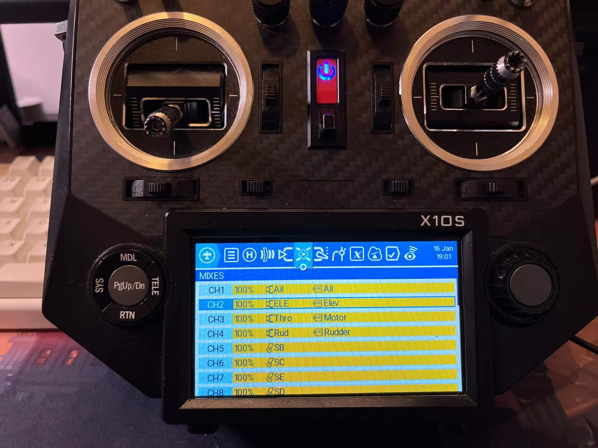
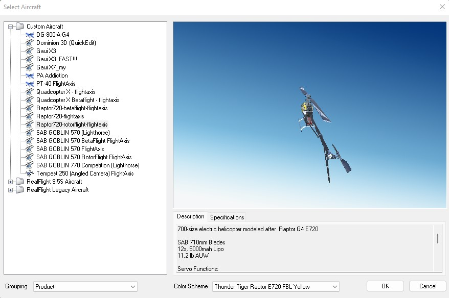
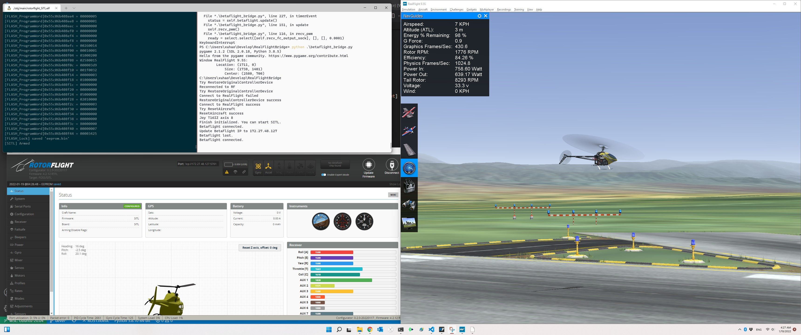

# SITL
## SITL in RealFlight 9

[RealFlight](https://www.realflight.com/) is one of the best commercial RC simulators with accurate airplane, helicopter, and multirotor simulations.
ArduPilot also offers [RealFlight SITL](https://ardupilot.org/dev/docs/sitl-with-realflight.html).
To use it you may need to purchase it on [Steam](https://store.steampowered.com/app/1070820/RealFlight_95S/) or [offical website](https://www.realflight.com/).

### Setup
To let BetaFlight SITL work with RealFlight, you need Windows 10 or Windows 11 with WSL. 
Ubuntu 20.04 in WSL2 on Windows 11 x64 is tested.
[RealFlightBridge](https://github.com/xuhao1/RealFlightBridge) is also required.

On WSL2, you need to configure the BetaFlight following [document here](https://github.com/betaflight/betaflight/blob/master/docs/development/Building%20in%20Windows.md).

Build BetaFlight with

```bash
$ make TARGET=SITL
```

On Windows, download RealFlightBridge by 

```bash
$ git clone https://github.com/xuhao1/RealFlightBridge.git
```

Import the quadcopter for RealFlight and BetaFlight at __models/Quadcopter X Betaflight - flightaxis_AV.RFX__ in RealFlightBridge. A detailed guide for improtanting can be found [here](https://ardupilot.org/dev/docs/sitl-with-realflight.html).
Moreover, update the setting of RealFlight to allow API.


You also need to prepare a controller for running SITL. 
I recommend to use transmitter with OpenTX/EdgeTX as a game controller. In addition, mixers of channel 5 and 6 should be mapped to two switches for arming and changing mode.


### SITL
To running SITL, you may need to:
1. Open and select the newly improted model __Quadcopter X Betaflight - flightaxis__ in RealFlight.
    

    You need to restart RealFlight after you *edit* the model in RealFlight!

2. Starting the RealFlightBridge in **Windows** by

    ```bash
    $ python betaflight_bridge.py
    ```

    You must start RealFlightBridge in Windows **before**  start the betaflight SITL.

3. Start BetaFlight SITL.
    First you need to get the Windows' IP in WSL.
    In WSL entering
    ```bash
    $ (ipconfig.exe | grep 'vEthernet (WSL)' -A4 | cut -d":" -f 2 | tail -n1 | sed -e 's/\s*//g') 
    172.19.32.1
    $ ifconfig
    eth0: flags=4163<UP,BROADCAST,RUNNING,MULTICAST>  mtu 1500
        inet 172.19.41.192 netmask 255.255.240.0  broadcast 172.19.47.255
        inet6 fe80::215:5dff:fea4:215d  prefixlen 64  scopeid 0x20<link>
        ether 00:15:5d:a4:21:5d  txqueuelen 1000  (Ethernet)
        RX packets 219079  bytes 32440158 (32.4 MB)
        RX errors 0  dropped 0  overruns 0  frame 0
        TX packets 145744  bytes 10533796 (10.5 MB)
        TX errors 0  dropped 0 overruns 0  carrier 0  collisions 0
    ```
    172.19.32.1 is the example output of your Windows IP and 172.19.41.192 is your WSL IP. **These IPs change everytime you reboot the computer.**

    Then go to the BetaFlight root and start SITL with this IP.
    ```bash
    $ cd ~/develop/betaflight/
    $ ./obj/main/betaflight_SITL.elf 172.19.32.1
    The SITL will output to IP 172.19.32.1:9002 (Gazebo) and 172.19.32.1:9001 (RealFlightBridge)
    [system]Init...
    init PwmOut UDP link to gazebo 172.19.32.1:9002...0
    init PwmOut UDP link to RF9 172.19.32.1:9001...0
    start UDP server @9003...0
    start UDP server for RC input @9004...0
    [FLASH_Unlock] loaded 'eeprom.bin', size = 32768 / 32768
    [timer]Init...
    [data]new fdm 136 t:182.834571 from 0.0.0.0:0
    [data]new rc 40: t:182.834571 AETR: 1498 1501 1105 1501 AUX1-4: 1100 1899 1899 1100
    bind port 5761 for UART1
    unusedPinsInit
    ```
    Then you can open BetaFlight configurator on **Windows** to connect to RealFlight via **WSL IP**.
    

    After connect to BetaFlight you need to set the arming switch with your controller.


4. Finally, you can arm and take-off the Quadcopter with BetaFlight SITL in RealFlight with your controller.



## Customize
If you want to create your own model and extend the SITL, please refer to this [guide](http://www.knifeedge.com/KEmax/) and this [document](https://github.com/xuhao1/RealFlightBridge/blob/main/docs/realflight_protocol.md).

## Known issues:
- RC SMOOTHING not work with SITL now, In 
```c
static FAST_CODE uint8_t processRcSmoothingFilter(void)
```
It will cause NaN.

## Mixer for "H-1" swash with single motor in SITL
```bash
# mixer input
mixer input ST 0 1000 1000

# mixer rule
mixer rule 0 set SR S1 1000 0 
mixer rule 1 set SP S2 1000 0 
mixer rule 2 set SC S3 1000 0 
mixer rule 3 set SY S4 -1000 0 
mixer rule 4 set ST M1 1000 0 
```
## Preset configs
[Raptor720](./RF_diff_90.txt)

[SAB GOBLIN 570](./RF_diff_570.txt)