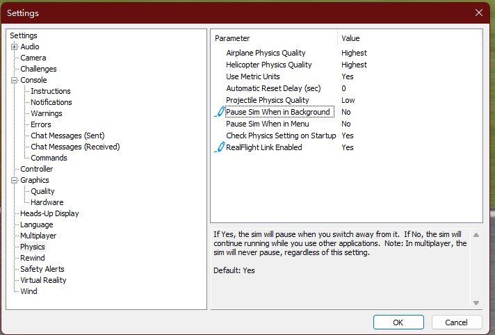

# SITL (Software In The Loop)

## SITL in RealFlight 9

Software in the Loop is useful for testing changes to the Rotorflight firmware code before it is deployed onto an actual helicopter.  This allow testing for bugs and other issues without risking real aircraft on those first test flights.  [RealFlight](https://www.realflight.com/) is one of the best commercial RC simulators with accurate airplane, helicopter, and multirotor physics simulations.

SITL is also available for other flight controllers, such as ArduPilot [ArduPilot SITL](https://ardupilot.org/dev/docs/sitl-with-realflight.html).

To use RealFlight SITL you will need to purchase RealFlight 9.5S on [Steam](https://store.steampowered.com/app/1070820/RealFlight_95S/) or visit the [offical website](https://www.realflight.com/).

### Setup

To let the Rotorflight firmware SITL work with RealFlight, you need Windows 10 or Windows 11 with WSL (Windows Subsystem for Linux). Ubuntu 20.04 in WSL2 on Windows 10 and Windows 11 x64 has been tested.  The Rotorflight firmware will run on the linux subsystem, while the python SITL bridge and RealFlight run on Windows.

Guide for installing WSL2 (choose Ubuntu 20.04 LTS in Microsoft Store):  [WSL2 Install](https://s1gr1d.medium.com/how-to-set-up-linux-on-windows-with-wsl-2-debe2a64d20d)

[RealFlightBridge](https://github.com/xuhao1/RealFlightBridge) is also required to be downloaded and setup in Windows. You will need Python and some additional libraries to run this.  Install these libraries:
- pip install transformations
- pip install pygame
- pip install PyQt5

### Clone Rotorflight repository, install toolchain, and build SITL target

    $ sudo apt update && apt upgrade
    $ sudo apt install build-essential libblocksruntime-dev git curl clang
    $ mkdir develop
    $ cd develop
    $ git clone https://github.com/rotorflight/rotorflight-firmware.git
    $ cd rotorflight-firmware
    $ make arm_sdk_install
    $ make TARGET=SITL


On Windows, download RealFlightBridge by 

```bash
$ git clone https://github.com/xuhao1/RealFlightBridge.git
```

Import a helicopter model for RealFlight and Rotorflight at __models/Raptor720-rotorflight-flightaxis_AV.RFX__ or __models/SAB GOBLIN 570 (Lighthorse)_EA__ in RealFlightBridge. A detailed guide for importing can be found [here](https://ardupilot.org/dev/docs/sitl-with-realflight.html).

Moreover, update the setting of RealFlight to allow API.


You also need to prepare a controller for running SITL. 
I recommend to use transmitter with OpenTX/EdgeTX as a game controller. Throttle and collective will need to be on separate channels, just like an actual Rotorflight setup.  In addition, mixers of channel 5 and 6 should be mapped to two switches for arming and changing modes.


### SITL

To run SITL, you may need to:

1. Open and select the newly imported model __Raptor720-rotorflight-flightaxis_AV__ in RealFlight.
    

    You need to restart RealFlight any time that you *edit* or load the model in RealFlight!

2. Starting the RealFlightBridge in **Windows** by

    ```bash
    $ python betaflight_bridge.py
    ```

    You must start RealFlightBridge in Windows **before**  starting the Rotorflight SITL firmware.

3. Start Rotorflight SITL firmware.
    First you need to get the Windows' IP in WSL.
    In WSL entering
    ```bash
    $ (ipconfig.exe | grep 'vEthernet (WSL)' -A4 | cut -d":" -f 2 | tail -n1 | sed -e 's/\s*//g') 
    172.19.32.1
    $ ifconfig
    eth0: flags=4163<UP,BROADCAST,RUNNING,MULTICAST>  mtu 1500
        inet 172.19.41.192 netmask 255.255.240.0  broadcast 172.19.47.255
        inet6 fe80::215:5dff:fea4:215d  prefixlen 64  scopeid 0x20<link>
        ether 00:15:5d:a4:21:5d  txqueuelen 1000  (Ethernet)
        RX packets 219079  bytes 32440158 (32.4 MB)
        RX errors 0  dropped 0  overruns 0  frame 0
        TX packets 145744  bytes 10533796 (10.5 MB)
        TX errors 0  dropped 0 overruns 0  carrier 0  collisions 0
    ```
    172.19.32.1 is the example output of your Windows IP and 172.19.41.192 is your WSL IP. **These IPs change everytime you reboot the computer.**

    Then go to the rotorflight-firmware folder and start SITL with this IP.
    ```bash
    $ cd ~/develop/rotorflight-firmware/
    $ ./obj/main/rotorflight_SITL.elf 172.19.32.1
    The SITL will output to IP 172.19.32.1:9002 (Gazebo) and 172.19.32.1:9001 (RealFlightBridge)
    [system]Init...
    init PwmOut UDP link to gazebo 172.19.32.1:9002...0
    init PwmOut UDP link to RF9 172.19.32.1:9001...0
    start UDP server @9003...0
    start UDP server for RC input @9004...0
    [FLASH_Unlock] loaded 'eeprom.bin', size = 32768 / 32768
    [timer]Init...
    [data]new fdm 136 t:182.834571 from 0.0.0.0:0
    [data]new rc 40: t:182.834571 AETR: 1498 1501 1105 1501 AUX1-4: 1100 1899 1899 1100
    bind port 5761 for UART1
    unusedPinsInit
    ```
4.  Then you can open rotorflight configurator on **Windows** to connect to RealFlight via the **WSL IP** you found earlier.

    Example:  tcp://172.19.41.192:5761
    
    

5.  Setup your Rotorflight configuration by loading in a preset config for the helicopter first:
    - [Raptor720](./Raptop_720.conf)
    - [SAB GOBLIN 570](./Goblin_570.conf)
    - Check your rxrange, aux assignments (modes), and channel order (map) to suit your transmitter setup
    
6. Finally, you can arm and take-off the Quadcopter with rotorflight SITL in RealFlight with your controller.  In order to fly you will need to set the throttle low and set the arming switch with your controller.


## Customize
If you want to create your own model and extend the SITL, please refer to this [guide](http://www.knifeedge.com/KEmax/) and this [document](https://github.com/xuhao1/RealFlightBridge/blob/main/docs/realflight_protocol.md).

## Known issues:
- RC SMOOTHING not work with SITL now, In 
```c
static FAST_CODE uint8_t processRcSmoothingFilter(void)
```
It will cause NaN.  Disable RC Smoothing.

## Mixer for "H-1" swash with single motor in SITL
```bash
# mixer input
mixer input ST 0 1000 1000

# mixer rule
mixer rule 0 set SR S1 1000 0 
mixer rule 1 set SP S2 1000 0 
mixer rule 2 set SC S3 1000 0 
mixer rule 3 set SY S4 -1000 0 
mixer rule 4 set ST M1 1000 0 
```
## Preset configs
[Raptor720](./Raptop_720.conf)
[SAB GOBLIN 570](./Goblin_570.conf)
