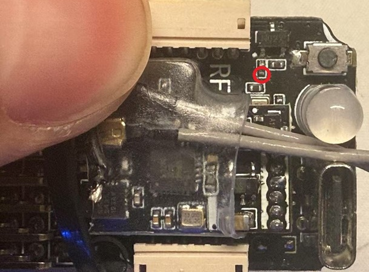

# Hardware Debugging with VSCode and JLink

This doc will guide you to set up Rotorflight firmware debugging in VSCode.

## Assumptions and Prerequisites

  * JLink: This guide assumes JLink. ST-Link/OpenOCD should be possible. but unverified.
  * Flydragon V2: Other controllers should be very similar.
  * SWD wiring: SWDIO, SWCLK, 3.3V, GND are required. SWO pin is optional for advanced topic.\
   
  * Linux build environment.
  * VSCode workspace connected to the build environment.
  * JLink, VSCode and build environment can be on 3 different hosts.
  * Optionally, use rotorflight-configurator to download your built firmware once, to load board config.

## Setup

### JLink host
(Skip if JLink and build environment are on the same host):
  1. Install JLink software.
  2. Run "JLink Remote Server" and start the server.\
  

### Build environment
  1. Install JLink software too.
  2. Install a recent version of `arm-none-eabi-gdb`. In my case, it is under `/usr/bin/arm-none-eabi-gdb`.
  3. Run `make clean` once, in case you have some cached `.o` and `.elf` without debug info.

### VSCode
  1. Open your rotorflight-firmware workspace.
  2. Install extension [Cortex-Debug](https://marketplace.visualstudio.com/items/?itemName=marus25.cortex-debug).
  3. Add these settings to `.vscode/settings.json`:
```
    "cortex-debug.armToolchainPath": "${workspaceRoot}/tools/gcc-arm-none-eabi-9-2020-q2-update/bin/",
    "cortex-debug.gdbPath": "/usr/bin/arm-none-eabi-gdb",
```
  4. Create `.vscode/tasks.json` (or merge) with the following content:
```
{
    "version": "2.0.0",
    "tasks": [
        {
            "type": "shell",
            "label": "build STM32F7X2",
            "command": "make",
            "args": ["STM32F7X2", "DEBUG=INFO", "-j8"],
            "problemMatcher": [],
            "options": {
                "cwd": "${workspaceFolder}"
            },
            "presentation": {
                "close": true
            },
        }
    ]
}
```
  5. Create `.vscode/launch.json` (or merge) with the following content:
```
{
  "version": "0.2.0",
  "configurations": [
    {
      "name": "Launch STM32F7X2 JLink",
      "cwd": "${workspaceRoot}",
      "executable": "${workspaceRoot}/obj/main/rotorflight_STM32F7X2.elf",
      "request": "launch",
      "type": "cortex-debug",
      "servertype": "jlink",
      "serverpath": "JLinkGDBServerCLExe",
      "ipAddress": "xxx.yyy.aaa.bbb", // Replace with your JLink host. Remove if run locally.
      "device": "STM32F722RE",
      "runToEntryPoint": "main",
      "serverArgs": [
        "-speed", "6000" // Optional: in case your jlink doesn't auto detect optimal speed for you
      ],
      "swoConfig": {
        "enabled": true,
        "source": "probe",
        "swoFrequency": 2000000,
        "cpuFrequency": 216000000,
        "decoders": [
          {
            "port": 0,
            "type": "console",
            "label": "SWO output",
            "encoding": "ascii"
          }
        ]
      },
      "preLaunchTask": "build STM32F7X2"
    }
  ]
}
```
  4. Now go to `Run and Debug` panel, select the configuration you just created, and click the green play button.\
  \
  VSCode will build, download and start a debug session.
  5. JLink by default only erases affected sections. Therefore, the configuration will preserve. In case you did
  not pre-load board config in the prerequisite steps, you can still manually download it from [rotorflight-target (Flydragon V2)](https://github.com/rotorflight/rotorflight-targets/blob/master/configs/FDRC-FLYDRAGONF722_V2.config) and load it in cli.

## Advanced debugging topic

### Attach to a running target
Duplicate the launch configuration. Replace `"request": "launch"` with `"request": "attach"` (and probably remove the `preLaunchTask` too). Give it a new name and select from the menu.

### SWO
SWO is an optional debug pin can be used for various purposes (https://kb.segger.com/SWO).

On Flydragon, the SWO pin (PB3) is not exposed as a pad but connects to the buzzer (through a driver). You will need to carefully solder a wire to this tiny resistor:\
\


And also unmap the pin from buzzer:
```
Resource BEEPER 1 NONE
```

#### SWO terminal
You can utilize high speed SWO terminal to print debug strings. First, add this piece of code to any (linked) .c file:
```
int _write(int file, char *ptr, int len)
{
    (void) file;
    int i;
    for (i = 0; i < len; i++) {
        ITM_SendChar(*ptr++);
    }
    return len;
}
```

Comment out this line from `src/main/common/platform.h` which prevents us to compile `printf`.
```
#pragma GCC poison sprintf snprintf
```

Now you can `printf` anywhere in the code and the output will be shown in the "TERMINAL" -> "SWO:SWO console":\


#### SWO graphing
You can send values to different ITM channels and plot a graph.
This is useful to track multiple variables or state machines.
Refer to https://github.com/Marus/cortex-debug/wiki/SWO-Output#output-graphing-graphing.

#### SWO trace
SWO trace is currently __not supported__ by Cortex-Debug extension. I suggest to use SEGGER Embedded Studio for this task -- "An externally built executable for a Cortex-M processor" project.
